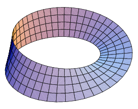

## Blood Omen: Legacy of Kain  
Transcrição traduzida [daqui](https://legacyofkain.fandom.com/wiki/Legacy_of_Kain_Wiki:Blood_Omen:_Legacy_of_Kain_transcript)  
  
Vae victis é uma expressão latina que significa "Ai dos vencidos", ou mais analiticamente, "triste sorte aquela reservada aos derrotados", pois os derrotados em batalha estão inteiramente entregues à misericórdia dos seus conquistadores e não devem esperar ou pedir leniência. (https://pt.wikipedia.org/wiki/Vae_victis)  
  
----  

== Capítulo Procurando Vingança ==  
== A Falha do Círculo ==  
  
CUTSCENE  
Há uma operação mágica de máxima importância: a iniciação de uma nova era. Quando for necessário pronunciar uma palavra, todo o planeta deverá estar banhado em sangue.  
  
  
Vorador chega e arregaça todo mundo  
Pessoas gritam por Malek quando Vorador chega arregaçando  
  
Vorador:  
  Chame seus cães! Eles podem festejar (banquete) com seus cadáveres  
  
Vorador mata Malek.  
  
Mortanius:  
  Por falhar no Círculo, Malek do Sarafan, você está condenado. Os prazeres da carne não são mais seus. Você tem apenas um propósito, guerreiro condenado; você nos servirá por toda a eternidade.  
  
Ariel morre e permanece como espírito nos pilares.  
  
FIM CUTSCENE 1  

----  

== Ziegsturhl ==  
Atendente do bar:  
  A taverna está fechando – é melhor ir embora, estranho.  
KAIN:  
  O quê, nenhuma caneca de cerveja para um viajante cansado da distante de Coorhagen? Posso recompensá-lo bem, pois tenho sangue nobre.  
  
Atendente do bar:  
  Não permaneço aberto a nenhum homem nestes tempos sombrios. Com a noite surgem coisas que nenhum homem sensato aceitaria.  
  
KAIN V.O. (voice over, ele só pensa, não fala pro atendente):  
  E então fui embora – com o coração e a alma frios. Forçado à estrada e à noite longa e amarga.  
  

Kain sai da taverna:  
  
Cara da rua:  
  É ele!  
Cara da rua 2:  
  Termine! Agora!  

----  

== Kain no Abismo ==  
CUTSCENE 2  
  
KAIN V.O.  
Vae victis – sofrimento para os conquistados. Irônico que agora era eu quem estava sofrendo. Nada tão comum quanto a dor física. Em vez disso, o golpe cruel de raiva impotente – a fome de vingança.  
Eu não me importava se estava no Céu ou no Inferno – tudo que eu queria era matar meus assassinos. Às vezes você consegue o que deseja.  
O Necromante Mortanius me ofereceu uma chance de vingança. E como um tolo, aceitei sua oferta sem considerar o custo.  
Nada é gratuito. Nem vingança.  
  
MORTANIUS:  
(risada) Você terá o sangue que deseja...  
FIM CUTSCENE 2  

----  

== Mausoléu de Kain ==  
KAIN V.O.:  
  Acordei com a dor de uma nova existência, num útero úmido de escuridão e decadência.  
  Dentro das paredes destas câmaras eu poderia encontrar descanso. E, se assim o desejar, retomar minha jornada quando meu cansaço diminuir.  
  
----  

== O cemitério ==  
  
KAIN V.O.:  
  O mundo havia mudado aos meus olhos. Eu não esperava tamanha crueldade da luz. Pois no abraço do sol não encontrei conforto, apenas malícia. Isso mudaria com o tempo para pior, junto com outras coisas.  
  
Depois que Kain sai do cemitério, ele quer se vingar daqueles que o mataram.  
  
KAIN V.O.:  
  A fome e a fraqueza não são obstáculo ao apelo da vingança. Eu encontraria meus assassinos e os enviaria de volta para o lugar de onde vim.  
  
Cara da rua:  
  Que bruxaria é essa?  
  
Cara da rua:  
  Ali está ele! Mate ele!  
  
Cara da rua:  
  Pensei que tivéssemos matado você, bastardo!  
  
Cara da rua:  
  Cai na minha, cara! Se te derrubarmos uma vez, podemos fazer isso de novo!  
  
KAIN V.O.:  
  Seus rostos zombeteiros ficaram para sempre gravados em minha memória. Eu havia atravessado a morte para este momento. Minha mente estava vazia, exceto por um pensamento: eu mataria.  
  
KAIN V.O.:   
Não há maior libertação do que a saciedade da vingança. Com meus assassinos mortos, minha missão acabou.  
  
Depois de matar os bandidos, Mortanius dá a Kain a primeira indicação sobre a complexidade de sua busca.  
  
MORTANIUS V.O.:  
  Isso não acabou, Kain. Esses idiotas foram apenas os instrumentos do seu assassinato, não a causa. Olhe para seus mestres. Olhe para os Pilares e abra caminho para a Fortaleza da Mente...  
  
----  

== Ziegsturhl ==  
  
KAIN V.O.:  
  Foi aqui que ocorreu o ato sangrento do meu assassinato. Eu não seria gentil com os habitantes que se escondem aqui. Eles provariam meu aço e eu, seu sangue.  
  
KAIN V.O.:  
  O Necromante não me deu um aviso sequer sobre o que a minha ressurreição implicaria, mas devo confessar que, na minha pressa, não procurei nenhum. Seu presente foi uma maldição? Eu buscaria uma resposta nos Pilares.    
  
----  

== Overland ==  

Kain encontra os Pilares de Nosgoth em sua jornada.  
  
KAIN V.O.:  
  Os Pilares de Nosgoth. Mesmo em vida, poucas paisagens me comoveram como esta. Fiquei maravilhado com o fato de tal beleza enfeitar nosso mundo moribundo.  
  
----  

== O Fantasma dos Pilares ==  
  
ARIEL:  
  Nupraptor, sua loucura destruiu nossos sonhos e cegou você...  
  
KAIN:  
  Mantenha distância ou vou mandá-la de volta para o Inferno, espírito!  
  
ARIEL:  
  Não sobrou nada em mim para temer vampiros. Sou apenas uma sombra do meu antigo eu... Ariel – o Equilíbrio do Círculo dos Nove. Mesmo assim, posso fornecer as respostas que você procura.  
  
KAIN:  
  Busco apenas uma cura.  
  
ARIEL  
  Não há cura para a morte. Apenas liberação. Você deve destruir a feitiçaria que agora está envenenando Nosgoth.  
  Só então você terá a paz.  
  Os Nove Protetores da Esperança juraram usar seus poderes para preservar nosso mundo. Agora estes pilares foram corrompidos por um traidor.  
  
Ariel se vira para a câmera para revelar seu rosto devastado. A carne foi arrancada para revelar o osso nu por baixo.  
  
ARIEL:  
  Meu assassinato pelas mãos desta besta enlouqueceu meu amor Nupraptor.  
  Agora ele espalha miséria e dor entre o Círculo, destruindo os próprios alicerces de Nosgoth. Você deve restaurar o equilíbrio. Você deve corrigir os Pilares de Nosgoth.  
  
KAIN (com desgosto):  
  Eu não me importo com o destino deste mundo.  
  
ARIEL (desaparecendo):  
  Então, por você, Kain...  
  Cuidado com o não dito...  
  
Ariel fica totalmente transparente à medida que sua voz desaparece.  
  
----  

== Capítulo Nupraptor ==  
== Os Pilares de Nosgoth ==  
  
KAIN V.O.:  
  Nupraptor, com seu ato cego de vingança, ameaçou destruir toda Nosgoth.  
  Cada membro do Círculo estava ligado ao Pilar que servia. Os Pilares refletiam o estado mental de seus servos e, à medida que as mentes do Círculo degeneravam e desciam ainda mais para a demência, os Pilares desmoronavam.  
  Para restaurá-los, cada membro do Círculo tem que morrer, e o artefato que serviu de ligação ao Pilar tem que ser devolvido.  
  Somente quando todos os Pilares forem restaurados, Ariel afirmou que minha maldição terminaria. E assim começou minha busca pelo Nupraptor.  
  
Examinando os pilares:  
 KAIN V.O.: O Pilar da Mente, protegido pelo Mentalista Nupraptor.  
 KAIN V.O.: O Pilar da Dimensão, protegido por "Planer" Azimuth. (acho que tem typo aqui. qq é planer?)  
 KAIN V.O.: O Pilar do Conflito, protegido por Paladino Malek.  
 KAIN V.O.: O Pilar da Natureza, protegido pelo Druida Bane.  
 KAIN V.O.: O Pilar do Equilíbrio, outrora defendido por Ariel. Os Pilares escolhem os seus próprios.  
 KAIN V.O.: O Pilar da Energia, protegido pelo Energista DeJoule (LOL DeJoule, Joule é a unidade tradicionalmente usada para medir energia mecânica. A unidade recebeu este nome em homenagem ao físico britânico James Prescott Joule)  
 KAIN V.O.: O Pilar do Tempo, protegido pelo Time Streamer Moebius. (aqui tem outro trocadilho. Uma fita de Moebius é uma fita que não tem dois lados (dentro e fora), ela somente tem um. https://pt.wikipedia.org/wiki/Fita_de_M%C3%B6bius. Ela é feita simplemente pegando uma tira, dobrando e colando as pontas. Em matemática isso muito estudado. Agora Streamer pode significar "uma tira longa e estreita de papel colorido que é usada como decoração para ocasiões especiais, como festas". Agora imagine essa fita como sendo feita de tempo e tendo as propriedades da fita de Moebius ahahha. Foram longe! Outra interpretação pode ser Streamer como uma pessoa que da fluxo, aqui fluxo de tempo, e como é o Moebius, não tem frente e trás, é uma coisa só)  

 

 KAIN V.O.: O Pilar dos Estados, protegido pelo Alquimista Anarcrothe.  
 KAIN V.O.: O Pilar da Morte, protegido pelo Necromante Mortanius.  
  
----  

== Overland ==  
KAIN V.O.:  
  Esses faróis servem como pontos de referência durante meus vôos em forma de morcego. Depois de memorizar suas localizações, sempre poderei retornar.  
  
----  

== Nachtholm ==  
KAIN V.O.:  
  A aldeia de Nachtholm era típica do campesinato Nosgoth, mas entre os agricultores e ferreiros da pacata vida rural rondavam bandidos e ladrões.  
  
----  

== Steinchencröe ==  
KAIN V.O.:  
  A cidade de Steinchencröe carregava consigo o aroma infame de seus habitantes. Em vida, eu não teria agraciado o lugar com a minha presença. Na morte, apenas aumentei o fedor.  
  
KAIN V.O.  
  Este lunático ficou encantado em me ver. Talvez sua loucura revelasse uma verdade maior...  
  
IRMOK  
  Os bastardos de Steinchencröe me evitam assim como Nosgoth os evita! Eu sei o que significa ser um estranho, vampiro. Não tenho medo de você, mas lembre-se disto: há outros que falarão com você, desde que você saiba como olhar.  
  
----  

== Vasserbünde ==  
  
KAIN V.O.:  
  Os ciganos – provedores de desconfiança e superstição. A maior parte de sua tagarelice deve ser encarada com uma pitada de sal, já que os ciganos costumam mexer nas mentes dos viajantes cansados... No entanto, alguns ciganos têm algo interessante a dizer.  
  
KAIN V.O.:  
  Vasserbünde jazia, com sua glória agora manchada e desbotada, uma criança fiel na sombra iminente do Retiro de Nupraptor.  
  
KAIN V.O.:  
  A Fortaleza de Nupraptor ficava a oeste de Vasserbünde. Eu procuraria cortar o câncer do seu coração.  
  
KAIN V.O.:  
  O vento carregava gritos do oeste. Não pude deixar de sorrir: outra pessoa neste mundo estava sofrendo mais do que eu.  
  
----  

== Retiro do Nupraptor ==  
  
KAIN V.O.:  
  A boca aberta do Retiro de Nupraptor fez chover sobre Nosgoth toda a sua dor e miséria. A doença implorou para ser limpa.  
  
KAIN V.O.:  
  O Mentalista Nupraptor era conhecido em Nosgoth por seus truques mentais, telepatia e telecinesia. Peregrinos viajaram de todo o país em busca do conforto de suas mentiras. Não busquei sua sabedoria, mas sua vida.  
  
NUPRAPTOR:  
  Você ousa invadir meu santuário? Não posso chorar em paz?  
  Vá embora... vá embora e deixe minha solidão ser completa...  
  
KAIN V.O.:  
  Encontrei uma das criadas do Nupraptor, catatônica de medo, engasgando meias palavras com dentes quebrados e ensanguentados. Embora tentado pela fome, contive a mão, permitindo que ela contasse sua história...  
  Ela falou de seu Lorde Nupraptor, levado à loucura pelo assassinato brutal de sua amada Ariel. Ela falou de sua automutilação, costurando seus olhos e lábios para negar o mundo exterior. Alimentado pelo desespero e pela desesperança, ele usou sua magia contra o Círculo, infectando suas mentes com sua loucura. Nupraptor não se importava com mais nada agora, exceto com sua patética autopiedade.  
  Cicatrizes como as dela nunca sarariam. A morte seria apenas uma misericórdia.  
  
MENINA SERVA CATATÔNICA:  
  (gritos e soluços incontroláveis, com essas palavras entrelaçadas)  
  ...o Lorde Nupraptor... se trancou... tentou matar todos nós... Ele está furioso com sua perda...  
  
KAIN V.O.:  
  O cretino desperdiçou a vida e a deixou escorrendo pelo chão. Esse desperdício era uma farsa. Talvez Nupraptor precisasse aprender uma lição sobre o valor do sangue.  
  
KAIN V.O.:  
  Das profundezas das órbitas oculares do Retiro, eu via Nosgoth de uma maneira diferente. O vidro parecia deformar a imagem e manchar a cor. Como se Nosgoth precisasse de ajuda para tornar aparente sua corrupção.  
  
NUPRAPTOR:  
  Então, Malek, você falhou no Círculo mais uma vez? Vá embora, paladino! Eu não preciso da sua proteção. Venha, Kain... venha compartilhar minha dor...  
  
KAIN V.O.:  
  Então este era o Nupraptor Mentalista, esse homenzinho patético e quebrado. No entanto, aleijado como estava, ele não cederia sem batalha. Muito bem, velho idiota. Se é a morte que você procura, não vou negar.  
  
KAIN V.O.:  
  Talvez a cabeça de seu amado convença Ariel de que cumpri minha tarefa.  
  
----  

== The Pillars of Nosgoth ==  
  
KAIN V.O.:  
  Coloquei a cabeça do Nupraptor diante do Pilar da Mente e observei enquanto ela se dissolvia na pedra.  
  
KAIN V.O.:  
  O pilar aceitou a oferenda e foi restaurado.  
  
KAIN V.O.:  
  Nupraptor era apenas a gênese – para sempre contaminado por sua loucura, o Círculo estava além da redenção. Para eles, a absolvição consistia apenas de morte. Em mim, eles encontrariam sua libertação.  
  Mas primeiro tive de derrotar o pastor deles – Malek, defensor dos Nove, estava numa fortaleza ao norte, depois de Vasserbünde. Era hora de testar a ira do Pilar do Conflito.  
  
ARIEL:  
  A Morte no Círculo dá vida aos Pilares. Para cada Pilar existe um token; somente com estes eles serão restaurados.  
  Mas para alcançar um guerreiro, você deve primeiro violar sua proteção. Encontre Malek e destrua-o. Só então o Círculo cairá.  
  
----  

== Capítulo A Caça por Malek ==  
== Coorhagen ==  
  
KAIN V.O.:  
  Anos atrás, chegou-nos a notícia de uma estranha pestilência que havia sitiado algumas aldeias remotas no extremo leste. Mas os rumores não conseguiram preparar-nos para o horror que foi a Peste.  
  
KAIN V.O.:  
  Vermes e larvas alimentavam-se de sua pele purulenta, o cheiro de sangue contaminado penetrava nas feridas nas quais eles se alimentavam. Pena... que desperdício; sangue bom deu errado.  
  
KAIN V.O.:  
  Coorhagen – minha casa – a melhor cidade de Nosgoth, rica em vaidade e presunção. Eu não tinha ilusões quanto às boas-vindas que receberia.  
  
KAIN V.O.:  
  Morte e doença perseguiam essas ruas. Os corpos jaziam, a maioria nos mesmos lugares para onde o destino os levara. Um regresso a casa perfeito.  
  
----  

== Overland ==  
  
KAIN V.O.:  
  O Bastião de Malek, empoleirado desafiadoramente no topo da montanha, negro como a noite contra o manto de neve. Que tipo de homem escolheria uma terra tão dura e totalmente desprovida de vida?  
  
----  

== Bastião de Malek ==  
  
MALEK:  
  Eu sei que você está aqui, demônio. O fedor da morte se apega a você.  
  
KAIN V.O.:  
  O interior era tão frio e estéril quanto a neve lá fora, com armaduras vazias e aço afiado e cruel revestindo as paredes.  
  
MALEK:  
  Meus guerreiros são apenas sombras de minha habilidade, criança.  
  
KAIN V.O.:  
  A imponente estrutura metálica deu origem a esses fantasmas. Eu poderia apenas arriscar um palpite sobre sua função: fundir as almas de guerreiros mortos há muito tempo às suas armaduras, para que possam lutar novamente.  
  Vida sem sangue. Que farsa!  
  
MALEK:  
  Você espera me vencer, Kain? Não se preocupe. Seu desafio não ficará sem resposta.  
  
MALEK:  
  Sua morte não o torna imortal, vampiro.  
  
MALEK:  
  Veio para matar o matador de vampiros, não é?  
  
KAIN V.O.:  
  O globo alimentava as máquinas. Com a sua destruição, os gritos ensurdecedores das máquinas deixaram de ecoar por todo o bastião. Agora era hora de silenciar o fabricante das máquinas.  
  
MALEK:  
  Você testa minha paciência, novato. Quer experimentar minha lâmina?  
  
KAIN V.O.:  
  Meus olhos ansiavam por falta de contraste, minha boca doía por falta de sangue. Neste deserto frio, a comida era escassa e a minha fome aumentou.  
  
KAIN V.O.:  
  Os guardas no portão não ofereceram resistência; eles estavam congelados e mortos enquanto estavam ali, sua carne soldada ao metal frio de sua armadura...  
  
KAIN V.O.:  
  Um cadáver ocupava a corte em um trono esfarrapado, sorrindo maliciosamente para mim através dos dentes enegrecidos.  
  
MALEK:  
  Não é sempre que um homem vê o seu próprio cadáver, é uma experiência preocupante.  
  Mas estou muito menos interessado no meu próprio cadáver do que no seu. Prepare-se, vampiro.  
  
KAIN V.O.:  
  Parece que o destino de Malek com minha lâmina foi adiado. Talvez Ariel pudesse oferecer mais orientações.  
  
----  

== Os Pilares de Nosgoth ==  
  
KAIN V.O.:  
  Ah, o senhor retorna de mãos vazias. O Sarafan te escapa? Muito bem, vá para o leste do Bastião de Malek.  
  O Oráculo lhe dará ajuda.  
  
----  

== Capítulo Busca pelo Oráculo ==  
== Bastião de Malek ==  
  
KAIN V.O.:  
  No alto desses penhascos, escondido entre uma complexa rede de cavernas, a santidade subterrânea do sábio Oráculo de Nosgoth jazia adormecida. Talvez fosse hora de enfrentar os ventos e procurar este Oráculo, do ponto de vista dos céus.  
  
----  

== A Caverna do Oráculo==   
  
MORTANIUS:  
  Oh, pequeno vampiro, o jogo fica interessante. Mas com tantos peões, você consegue encontrar o verdadeiro jogador?  
  
KAIN V.O.:  
  Estranho. Esta armadura lembrava a do Guardião (Ward) e seus asseclas. No entanto, o aço parecia recém-formado e imaculado pelo tempo.  
  
KAIN V.O.:  
  Uma guilhotina, a lâmina ainda molhada de sangue.  
  
KAIN V.O.:  
  Reconheci esse brasão desde a minha juventude. Este é o sigilo do Poderoso Leão de Willendorf, manchado de sangue e enferrujado neste escudo desgastado.  
  
KAIN V.O.:  
  O escudo foi recém-fabricado e seu metal brilhava intensamente à luz do fogo. A crista eu não reconheci.  
  
KAIN V.O.:  
  Escondida entre os muitos artefatos obscuros daquele museu, descobri uma antiga crônica. Esta passagem me chamou a atenção:  
  "Foi durante esses tempos sombrios infestados pela praga dos mortos-vivos, que o Círculo trouxe o Sarafan à existência. Treinados para serem devotamente leais ao Círculo e os exterminadores perfeitos do flagelo dos mortos-vivos, eles foram levados a muitas vitórias pelo paladino justo, Malek, protetor do Pilar do Conflito. Eles purificaram os vampiros com fogo e libertaram suas almas para reinos mais abençoados. Não há ira tão terrível quanto a dos justos.  
  Eu já tinha lido o suficiente. Ao mesmo tempo enojado e intrigado, coloquei o livro de volta naquele museu.  
  
----  

== O Oracle (cutscene) ==  
  
Kain entra em uma grande caverna através de um túnel sinuoso. Dentro da caverna, um velhinho está sentado perto de uma lareira acesa, cozinhando algo em uma panela enorme. Ele olha para cima quando Kain entra.  
  
ORÁCULO:  
  Um nobre? Procurando sabedoria? A morte te ensinou bem.  
  
KAIN:  
  Chega de filosofia – procuro respostas.  
  
ORÁCULO:  
  De fato, respostas. Eu tenho todos elas se você tiver dúvidas. E quais são as perguntas para essas respostas?  
  (Oráculo joga algo no fogo. A fumaça revela um grande exército marchando pela terra.)  
  Rei Ottmar – a única esperança de derrotar as Legiões do Nemesis.  
  
ORÁCULO:  
  Rei Ottmar paralisado pelo mal-estar de sua princesa.  
  Rei Ottmar, o inútil.  
  Por favor, bom senhor, quais são as perguntas?  
  
KAIN (com raiva):  
  Uma varíola em seus truques e tagarelices, velho! Responda-me isto: quem é Malek e como posso derrotá-lo?  
  
ORÁCULO (cripticamente):  
  Tudo a tempo, senhor. Sim, hora. A menos que você o domine – ele dominará você.  
  E agora é hora da sua resposta:  
  
Oráculo joga pólvora no fogo.  
Exibição de imagens.  
  
ORÁCULO:  
  Malek – defensor dos Nove e último dos sacerdotes-feiticeiros Sarafan. Sua vaidade levou ao massacre do Círculo nas mãos do vampiro Vorador. Por sua falha, seu espírito foi fundido a um conjunto infernal de armadura mágica. Ele não permitiu que nenhum membro do Círculo caísse desde então.  
  
KAIN:  
  E esse Vorador?  
  
ORÁCULO:  
  Siga o brilho do Ignis Fatuus até a Floresta Termogent.  
  
KAIN:  
  Ignis Fatuus?  
  
ORÁCULO:  
  O Ignis Fatuus ilumina o caminho para o Inferno, nobre. Seu caminho.  
  
ORÁCULO:  
  Hora, Kain. Próxima vez  
  
Oráculo desaparece. Sua voz desaparece enquanto ele faz isso.  
  
----  
  
FIM de onde chegamos.  
Começa novo capítulo: Vorador's Mansion  
